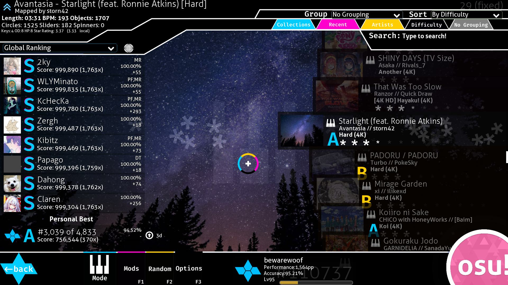
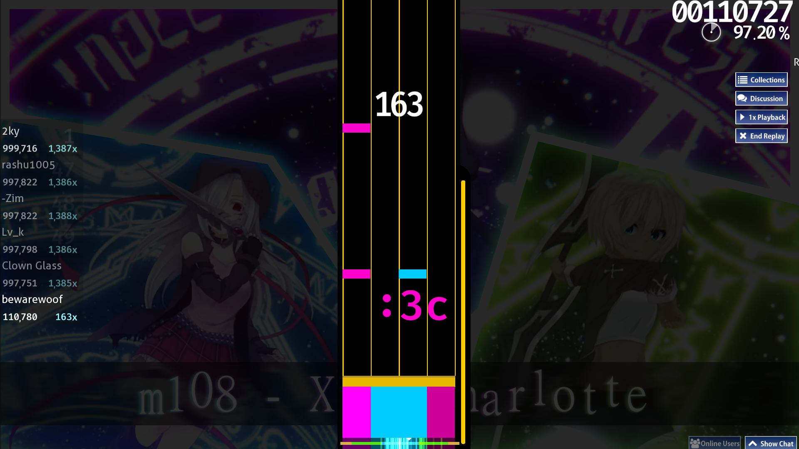
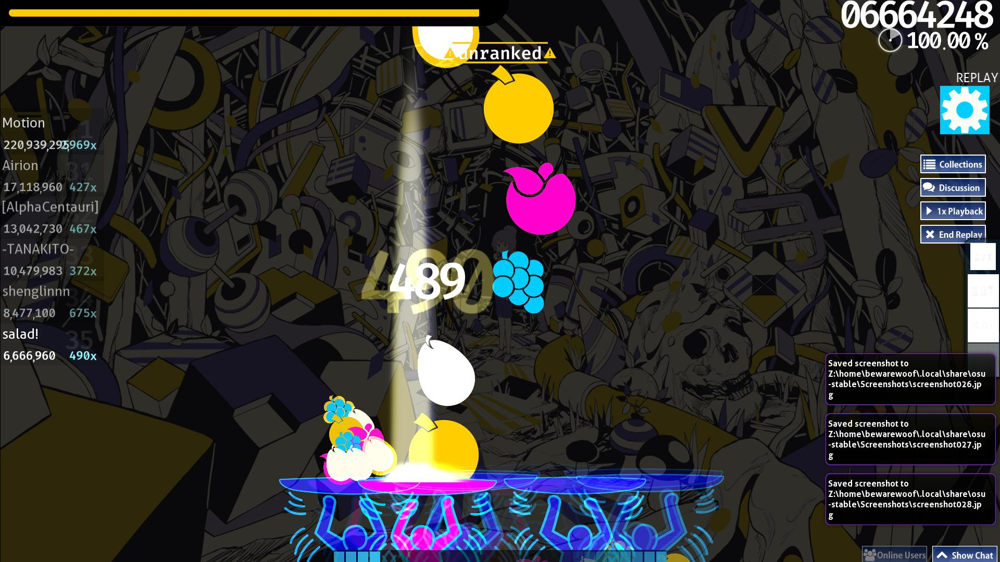
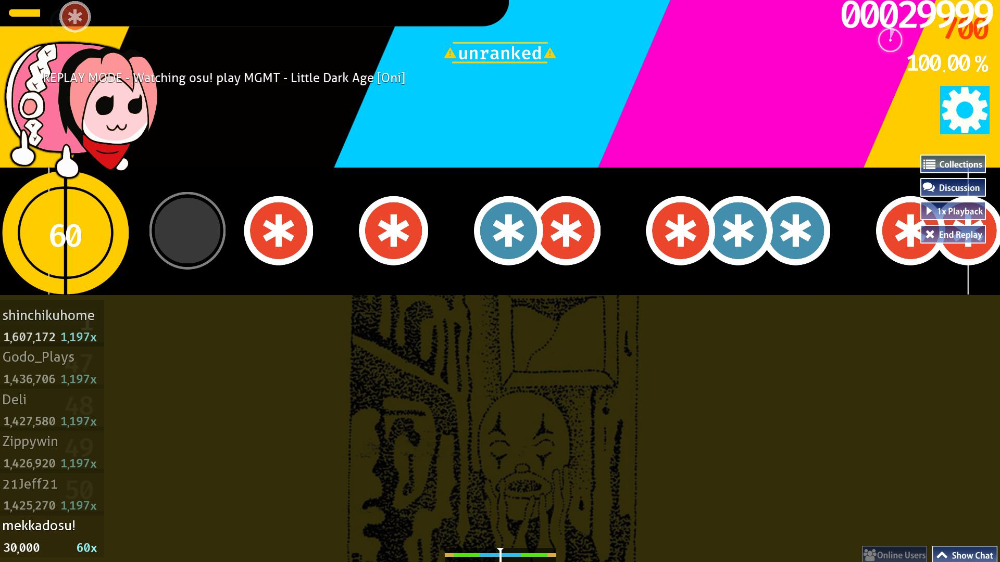
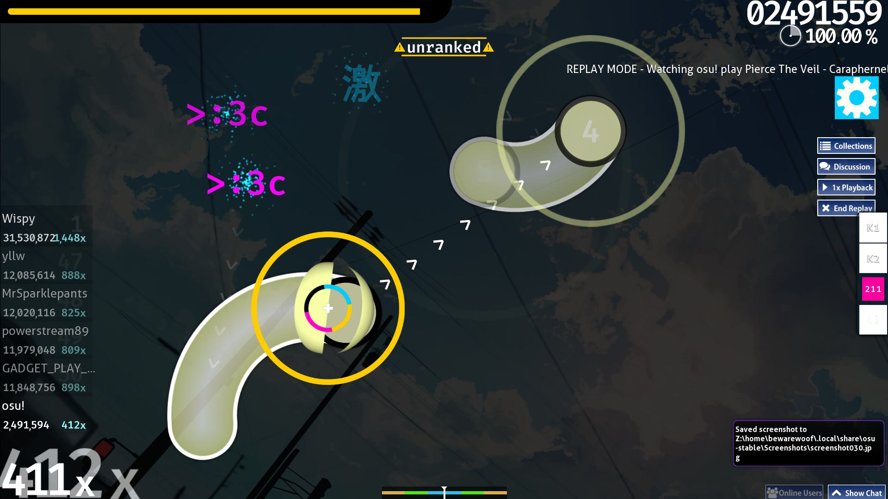
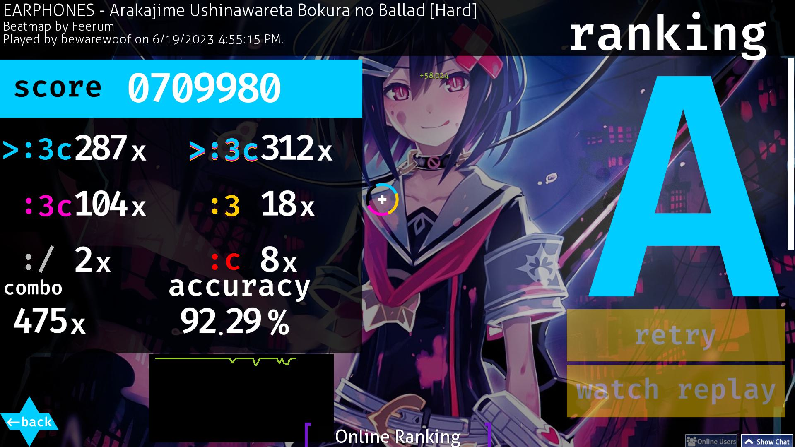

# Inkjet-Osu-Skin
A CMYK-based skin for osu!, designed primarily for mania, but with (mostly) complete skin support for all main game modes.

Still to be skinned:

-Pipidon's animations in Taiko

-Slider Ball in Standard

-Misc. decorative elements

